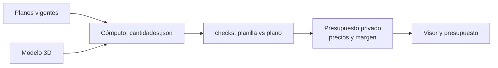
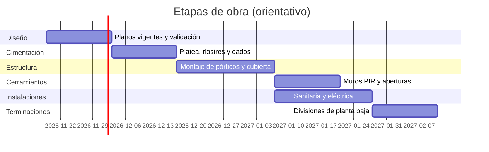

# Flujo de trabajo · Pedragosa Sierra

```mermaid
flowchart LR
    P[Planos vigentes] --> C[Cómputo: cantidades.json]
    M[Modelo 3D] --> C
    C --> K[checks: planilla vs plano]
    K --> B[Presupuesto privado<br/>precios y margen]
    B --> V[Visor y presupuesto]
```

## Etapas

```mermaid
gantt
    title Etapas de obra (orientativo)
    dateFormat YYYY-MM-DD
    section Diseño
    Planos vigentes y validación     :a1, 2026-11-19, 14d
    section Cimentación
    Platea, riostres y dados         :a2, after a1, 14d
    section Estructura
    Montaje de pórticos y cubierta   :a3, after a2, 21d
    section Cerramientos
    Muros PIR y aberturas            :a4, after a3, 14d
    section Instalaciones
    Sanitaria y eléctrica            :a5, after a3, 21d
    section Terminaciones
    Divisiones de planta baja        :a6, after a5, 14d
```

Las fechas son orientativas y se ajustan con la obra.
